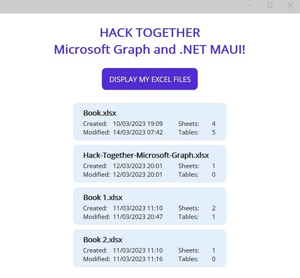

# File Explorer with Microsoft Graph API

This project was created for Microsoft’s **Hack Together: Microsoft Graph and .NET** event.

## Overview

This application explores Graph API with Microsoft Graph .NET SDK in the following steps:

- Access user's drive and retrieve available properties about stored Excel workbooks.
- Read additional properties directly from Excel workbooks - number of Sheets and number of Tables.
- Display selected properties in a simple MAUI application.

## Screenshot

## Setup

Follow below steps to use this app:

- Create an app registration in Azure AD. 

- Add following permissions to your app:
	- User.Read
	- Files.Read

- Update client secrets in `GraphService.cs` file:
	- `TenantId`
	- `ClientId`

## Note

Supported platform for MAUI application is **Windows**.

